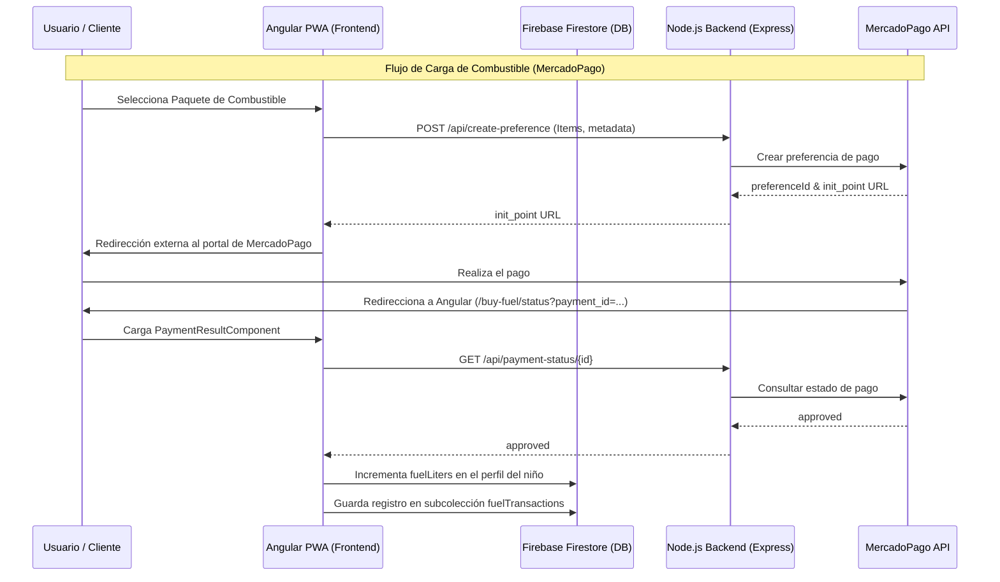

# Arquitectura del Proyecto P.I.V.E.S.

El proyecto **P.I.V.E.S.** sigue una arquitectura de capas bien definida en el frontend (Angular 20) coordinada con un servidor API REST desacoplado (Node.js/Express) para tareas seguras y pasarelas de pago.

---

## 1. Arquitectura General (Frontend)

El frontend está estructurado en tres capas principales que aíslan la lógica del negocio de los componentes visuales:

1. **Capa Core (Singleton Services & Data Centralization):**
   - Aloja los servicios globales inyectados en el root de la aplicación (`providedIn: 'root'`).
   - Mantiene el estado en memoria mediante Subjects reactivos (`BehaviorSubject`, `ReplaySubject`) y expone Observables para los componentes.
   - Centraliza las llamadas directas a Firebase Auth, Firestore y llamadas REST al backend.
2. **Capa Shared (Reutilización UI):**
   - Aloja componentes transversales (Header de navegación, Breadcrumbs, Loader de pantalla, Notificaciones Toast flotantes).
   - Exporta módulos de uso común (`CommonModule`, `RouterModule`, `FormsModule`, `ReactiveFormsModule`).
3. **Capa Features (Módulos de Negocio):**
   - Agrupa las vistas y flujos específicos de la aplicación.
   - Cada feature es un módulo autocontenido que se carga bajo demanda (Lazy Loading) mediante el enrutador de Angular, optimizando el tamaño de descarga inicial (PWA).

---

## 2. Flujo de Datos Técnico

### A. Sincronización en Tiempo Real (Firestore)
- Al autenticarse un usuario (`AuthService`), el sistema inicia una escucha en tiempo real (`onSnapshot`) sobre la ruta de Firestore `/users/{uid}`.
- Cuando esta colección cambia (ya sea porque el usuario avanza de nivel, compra nafta o registra un turno), Firestore notifica a la aplicación y `UserService` procesa la migración/actualización de los datos.
- Esto propaga los cambios reactivamente por toda la UI gracias a la tubería observable `activeChild$` y `currentUserAccount$`.

### B. Flujo de Compra de Combustible (MercadoPago Integration)
La nafta virtual sirve como moneda de cambio para agendar turnos de conducción. Su compra sigue el siguiente flujo secuencial:

### C. Flujo de Reserva de Turnos y Correos
1. El usuario selecciona un coche y un horario en `BookingComponent`.
2. El sistema valida los créditos de nafta del niño activo.
3. Se invoca a `AdminService` para escanear en memoria las reservas existentes de todos los usuarios en la fecha seleccionada y evitar reservas duplicadas en un mismo coche.
4. Si pasa las validaciones, se descuenta la nafta del perfil del niño y se añade la reserva bajo su arreglo `bookings` en Firestore.
5. El componente realiza una llamada `POST` al servidor backend `/api/send-confirmation` enviando los datos del turno. El servidor utiliza el SDK de **Resend** para despachar el correo electrónico de confirmación al padre de forma segura.

### D. Flujo de Recordatorios y Cron
El servidor de Express expone una ruta `/api/check-reminders` diseñada para ser ejecutada periódicamente por un orquestador cron externo (ej. Render Cron, GitHub Actions):
1. El endpoint recorre todos los documentos en la colección `/users` de Firestore.
2. Para cada reserva activa, verifica si la fecha corresponde al día de mañana (recordatorio de 24 hs) o a la fecha de hoy (recordatorio de mismo día).
3. Si corresponde y el recordatorio no ha sido enviado previamente (`booking.remindersSent`), el servidor despacha un correo electrónico usando Resend y actualiza los flags correspondientes en Firestore para evitar envíos duplicados.

---

## 3. Flujo de Navegación y Rutas (Guards)

La navegación entre vistas está controlada por tres Guards principales:
- **`AuthGuard`:** Comprueba que el usuario esté autenticado en Firebase y que su correo esté verificado (`emailVerified: true`). Si no lo está, lo redirige a la pantalla de bienvenida pública (`/welcome`).
- **`OnboardingGuard`:** Comprueba si el niño seleccionado (`activeChild$`) completó el tutorial interactivo inicial de Mara (`hasCompletedOnboarding: true`). Si es falso, fuerza la redirección a `/onboarding`.
- **`AdminGuard`:** Comprueba si la cuenta familiar posee el atributo `isAdmin: true` en la base de datos o si su correo electrónico coincide con el súper administrador (`testahermanos@gmail.com`). Restringe el acceso a la zona `/admin`.
